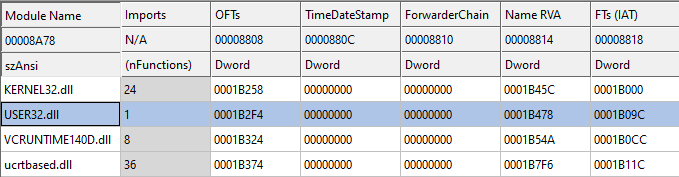
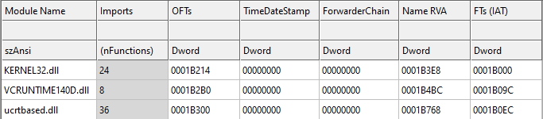

# API hashing

API hashing - a technique used by malware developers, that makes program analysis a bit more difficult by hiding suspicious imported Windows APIs from the IAT of the PE.

## How It Works

We have a list of all exported function names for a given DLL. We can now calculate a hash for each function name. The hash function doesn't need be cryptographically secure. It only needs to be relatively collision-free on the set of all exported function names.

You can use any external script to calculate the hash. In my case, I used a simple python script that I attached to the repository.

```python
# installing script dependencies
pip3 install -r requirements.txt

# you can specify which DLLs will be passed through the hash function,
# by changing the next line:
glob.glob(r'C:\Windows\System32\user32.dll')

# for exmaple, to include all system DLLs you should type:
glob.glob(r'C:\Windows\System32\*.dll')
```

After using the script, we will get a json file that will contain function names and their hash.

```
[snip]
 "user32.dll": {
        "hash": "0x814ea",
        "export": {
            "MessageBoxA": "0x92b4d",
            ...
[snip]
```

Now we take the resulting hash of the desired function
and define it as constant value inside main code.

In my case it looks like that
```c++
#define MessageBoxA_hash  0x92b4d 
```
 Now we need to implement the hash function that we used before, but now in the main code.<br />
 After that, we also need to create a function that will list all the loaded functions of the module we want to use and compare their hashes with our defined one.

 After the function address is found, the only thing left to do is to properly cast our function and call it the way we want to.

 |  DEFAULT IAT                     |
 | -------------------------------- | 
 |    |

 | USING API HASHING                |
 | -------------------------------- |
 |    |
 
  
